# SHOTLY

> Site institucional da **SHOTLY**, agência de fotografia premium.  
> Projeto totalmente estático — sem frameworks, sem build tools, sem dependências a instalar.

---

## ✨ Destaques Visuais

### 🏠 Página Principal — Hero & Sobre

| Hero | Sobre |
|:---:|:---:|
| 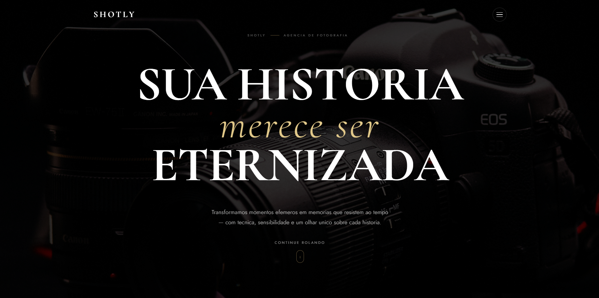 | 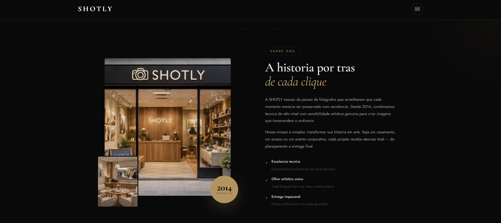 |

<br>

### 📸 Técnica & Showcase

| Técnica & Luz | Showcase / Carrossel |
|:---:|:---:|
| 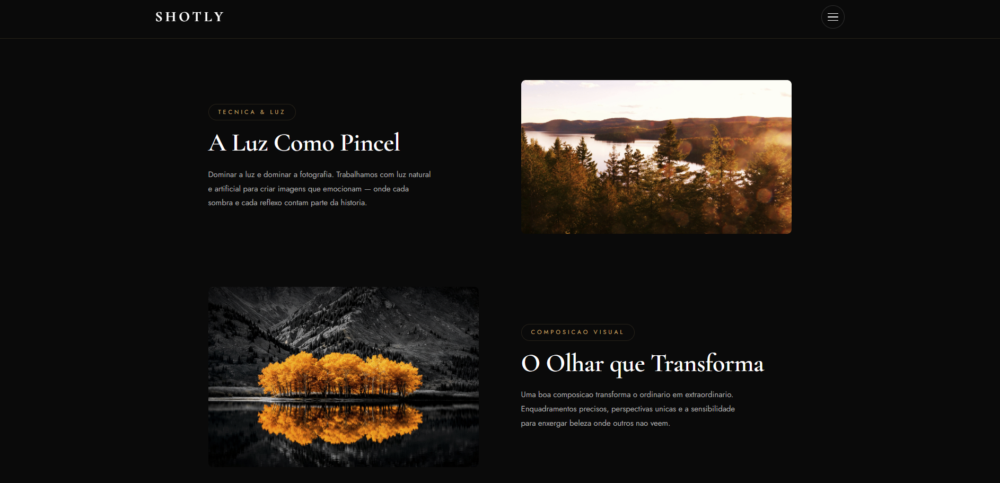 | 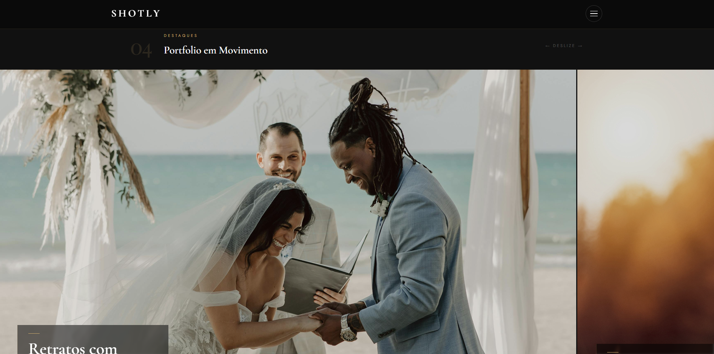 |

<br>

### 🛠️ Serviços & Processo

| Serviços | Processo |
|:---:|:---:|
| 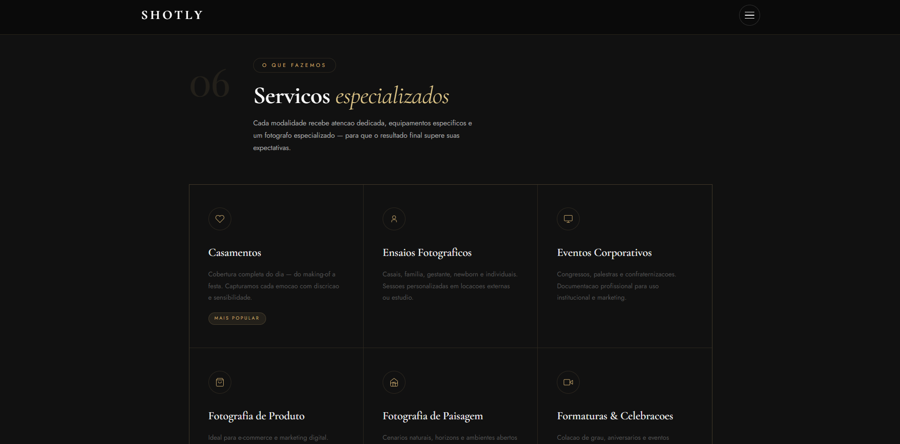 | 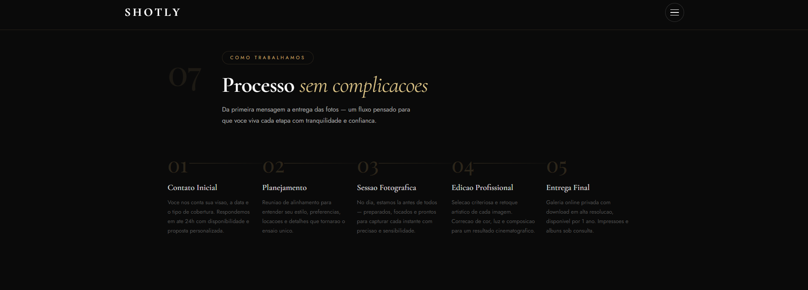 |

<br>

### 💬 Depoimentos & Estatísticas

| Depoimentos | Estatísticas |
|:---:|:---:|
| 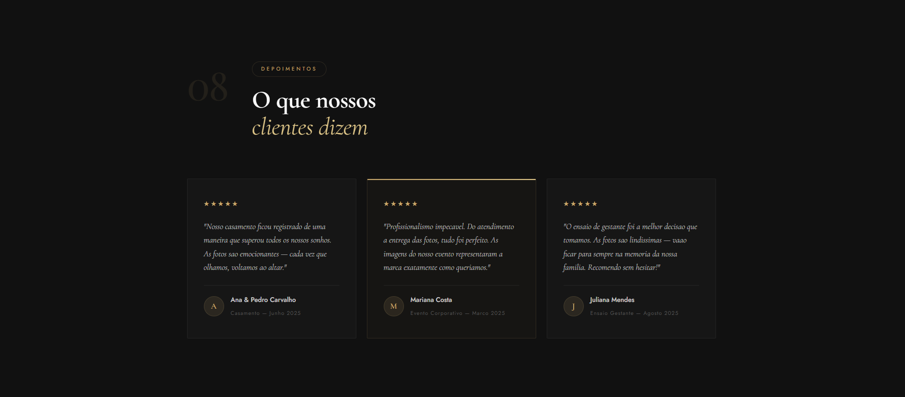 | 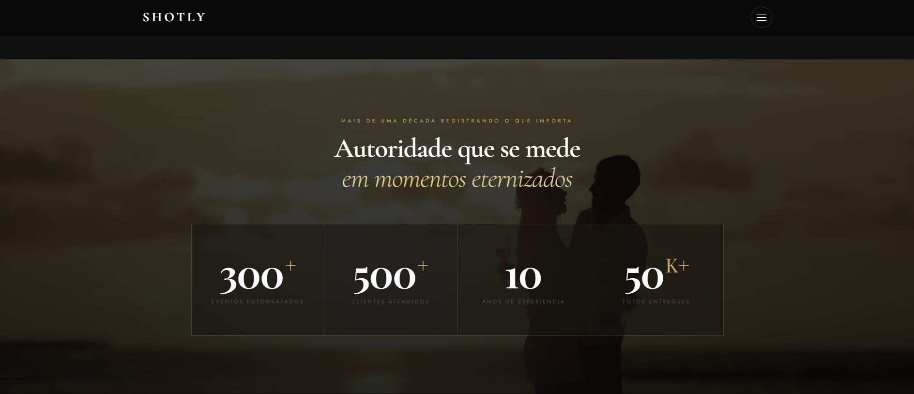 |

<br>

### 📬 CTA & Contato

| CTA Principal | Formulário de Contato |
|:---:|:---:|
| 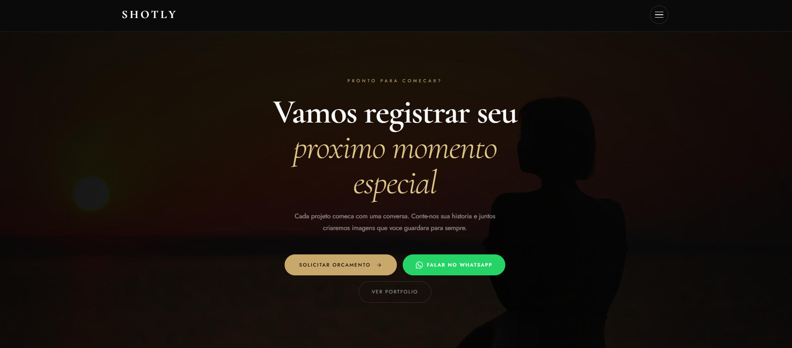 | 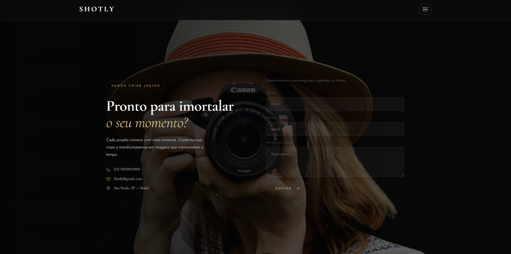 |

<br>

### 🖼️ Portfólio & Blog

| Portfólio | Blog |
|:---:|:---:|
| 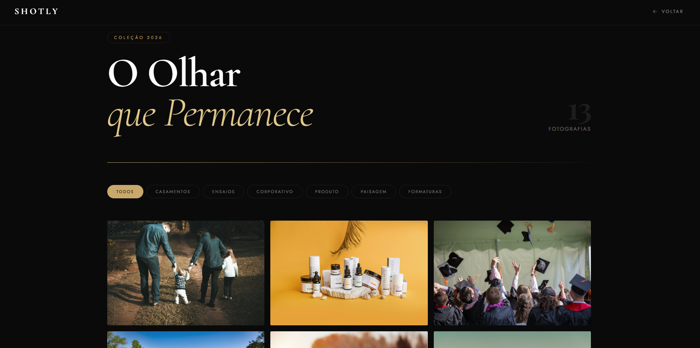 | 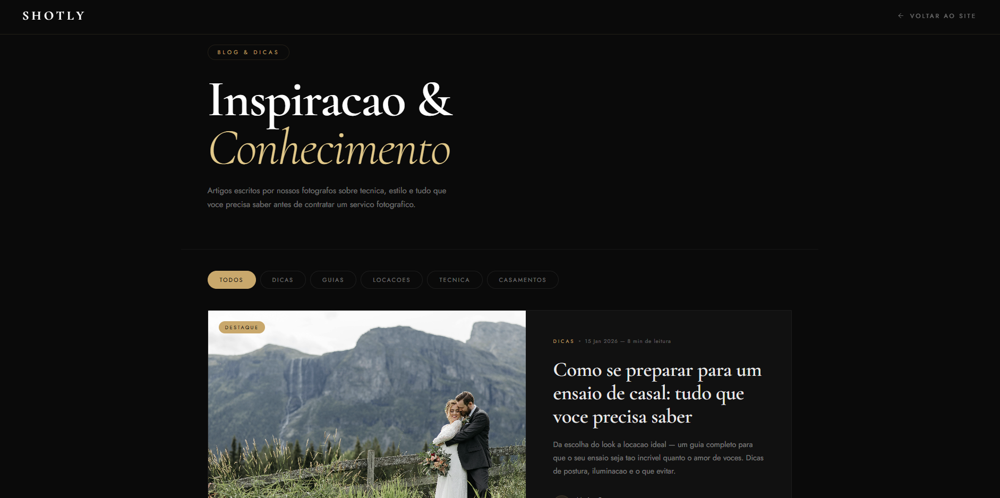 |


---

## Sobre o Projeto

A **SHOTLY** é um site institucional de agência de fotografia premium desenvolvido como projeto pessoal de portfólio. O objetivo foi criar uma experiência visual e interativa premium, explorando animações orientadas a scroll, tipografia editorial e composição cinematográfica em fundo escuro com acento dourado.

O projeto cobre o ciclo completo de um site de agência real: apresentação da marca, portfólio filtrável por categoria, blog com sistema de tags, formulário de orçamento e integração com WhatsApp.

---

## Páginas

### `index.html` — Página Principal

| # | Seção | Descrição |
|---|---|---|
| 01 | Hero | Apresentação com imagem de fundo, título editorial e scroll indicator |
| 02 | Sobre | História da agência, valores e diferenciais com grid assimétrico |
| 03 | Técnica & Luz | Destaque sobre iluminação e composição fotográfica |
| 04 | Showcase | Carrossel horizontal com fotos do portfólio |
| 05 | Lifestyle | Banner imersivo com link para o portfólio completo |
| 06 | Serviços | Cards com as modalidades oferecidas |
| 07 | Processo | Passo a passo do fluxo de trabalho com conectores animados |
| 08 | Depoimentos | Avaliações de clientes com card em destaque |
| 09 | Estatísticas | Números da agência com animação de contador via ScrollTrigger |
| 10 | Blog | Preview dos artigos mais recentes |
| 11 | CTA Principal | Chamada para ação com botões de contato e WhatsApp |
| 12 | Contato | Formulário de orçamento e informações de contato |

### `portfolio.html` — Portfólio

Galeria completa com filtro por categoria: Casamentos · Ensaios · Corporativo · Natureza · Formaturas · Produtos.  
Estilos escritos diretamente no `<style>` interno da página.

### `blog.html` — Blog

Listagem de artigos com categorias, tempo de leitura estimado e sistema de filtro por tag.  
Estilos escritos diretamente no `<style>` interno da página.

---

## Tecnologias

| Tecnologia | Função |
|---|---|
| HTML5 + CSS3 | Estrutura e estilização |
| [GSAP 3](https://gsap.com) | Animações de entrada e scroll |
| [ScrollTrigger](https://gsap.com/docs/v3/Plugins/ScrollTrigger/) | Gatilhos de animação baseados no scroll |
| [Lenis](https://github.com/studio-freight/lenis) | Smooth scrolling |
| Google Fonts | Cormorant Garamond · Jost · Playfair Display |

---

## Como Rodar

```bash
# Sem instalação necessária — basta abrir no navegador:
open index.html

# Para desenvolvimento com live reload, recomenda-se:
# Extensão Live Server no VS Code
```

---

## Estrutura de Arquivos

```
shotly/
├── index.html            → página principal (landing page)
├── portfolio.html        → galeria completa com filtros
├── blog.html             → listagem de artigos
├── style.css             → estilização da página principal
├── script.js             → animações e interações (GSAP + Lenis)
├── assets/
│   └── images/           → todas as imagens do projeto
└── docs/
    └── images/           → screenshots para este README
```

---

## Imagens do Projeto

Todas as imagens ficam em `assets/images/`. Os nomes esperados são:

```
hero.jpg          → imagem principal do Hero (fundo escuro)
sobre-frame1.png  → foto da seção Sobre (frame 1)
sobre-frame2.png  → foto da seção Sobre (frame 2)
tecnica-1.jpg     → seção Técnica & Luz (imagem 1)
tecnica-2.png     → seção Técnica & Luz (imagem 2)
lifestyle.jpg     → banner Lifestyle
casamento-1.jpg   → showcase / portfólio
ensaio-2.jpg      → showcase / portfólio
formatura-1.jpg   → showcase / portfólio
blog-1.jpg        → card de blog (artigo 1)
blog-2.jpg        → card de blog (artigo 2)
blog-3.jpg        → card de blog (artigo 3)
estatisticas.jpg  → fundo da seção de estatísticas
cta.jpg           → fundo da seção CTA principal
contact.png       → fundo da seção de contato
footer.png        → fundo do footer
```

---

## Personalização Rápida

- **Cores e variáveis** → bloco `:root { }` no topo do `style.css` (e no `<style>` interno de cada página secundária)
- **Textos e conteúdo** → diretamente nos arquivos `.html`
- **WhatsApp** → substituir o número em `https://wa.me/5511999999999` no `index.html`
- **Redes sociais** → atualizar os `href="#"` nos ícones do menu lateral e do footer
- **Velocidade das animações** → propriedades `duration` e `delay` no `script.js`

---

## 📄 Licença

Distribuído sob a licença MIT. Consulte o arquivo [`LICENSE.txt`](LICENSE.txt) para mais informações.

---

© 2026 SHOTLY · Jhonatan Pedro